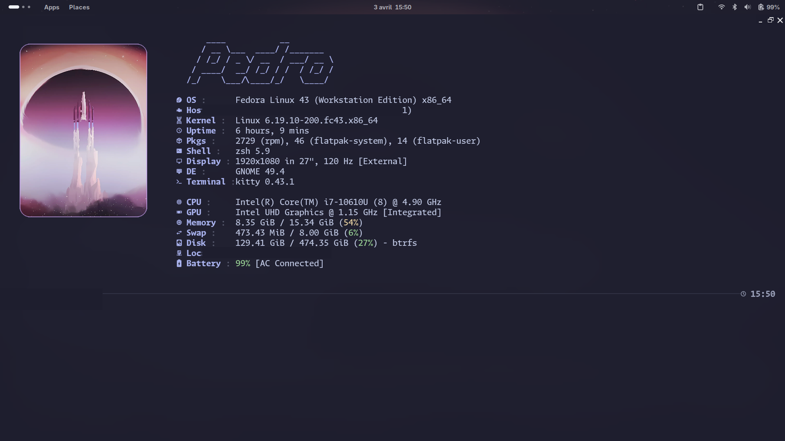

# dotfiles

GNOME setup on Fedora (primary) and Ubuntu. Terminal-first, keyboard-driven, Catppuccin Mauve everywhere.

---

## What's in here

| Path | What it does |
|------|--------------|
| `.zshrc` / `.bashrc` | Shell config — Starship, zoxide, eza, bat, lazygit aliases |
| `.config/starship.toml` | 2-line prompt: fill bar + clock on the right, `╰─` connector |
| `.config/kitty/` | Kitty terminal — Catppuccin Mocha theme, Monaspace Argon 15pt |
| `.config/fastfetch/` | System info on shell open — kitty-direct image, Catppuccin colors |
| `.config/nvim/` | LazyVim with a few extra plugins |
| `.config/gnome/` | dconf dumps + `apply-gnome.sh` to replay the full GNOME setup |
| `.local/share/icons/Hatter-FluentFiles/` | Merged icon theme (see below) |
| `.local/share/fonts/Monaspace/` | MonaspiceAr Nerd Font Mono (Regular, Italic, Bold, BoldItalic) |

---

## Install

```bash
git clone https://github.com/ruipedro-pinheiro/dotfiles ~/dotfiles
cd ~/dotfiles
./install.sh
```

`install.sh` symlinks everything into `~`. Existing files are backed up to `~/.local/state/dotfiles-install-backups/` before being replaced.

Then optionally, to apply the GNOME settings (extensions must already be installed):

```bash
~/.config/gnome/apply-gnome.sh
```

No sudo needed — everything goes into `~/.local` or `~/.config`.

---

## Theme

- **Terminal:** [Kitty](https://sw.kovidgoyal.net/kitty/) + [Catppuccin Mocha](https://github.com/catppuccin/kitty)
- **Prompt:** [Starship](https://starship.rs/)
- **Shell fetch:** [Fastfetch](https://github.com/fastfetch-cli/fastfetch)
- **GTK theme:** Catppuccin-Mauve-Dark
- **Icons:** Hatter-FluentFiles (merged, see below)
- **Cursor:** Bibata-Modern-Ice
- **Font:** [Monaspace Argon Nerd Font](https://monaspace.githubnext.com/)
- **Wallpaper:** [ArtStation — OGaRR6](https://www.artstation.com/artwork/OGaRR6)

---

## GNOME extensions

- [Blur my Shell](https://extensions.gnome.org/extension/3193/blur-my-shell/)
- [Dash to Dock](https://extensions.gnome.org/extension/307/dash-to-dock/)
- [User Themes](https://extensions.gnome.org/extension/19/user-themes/)

---

## Icon theme

`Hatter-FluentFiles` is a merged theme, not an overlay. The base is [Hatter](https://github.com/zigorki/hatter-icon-theme) for app icons, with file/folder icons swapped out for [Fluent](https://github.com/vinceliuice/Fluent-icon-theme) ones so Nautilus looks consistent with the rest of the desktop.

---

## Notes

- Tested on Fedora 43 (Wayland) and Ubuntu 24.04 (X11)
- `Blur my Shell` can conflict with workspace animations on GNOME 49+ — disable app blur if it causes issues
- The `nvim/` config is a standalone [LazyVim](https://lazyvim.org/) setup and manages its own plugins
