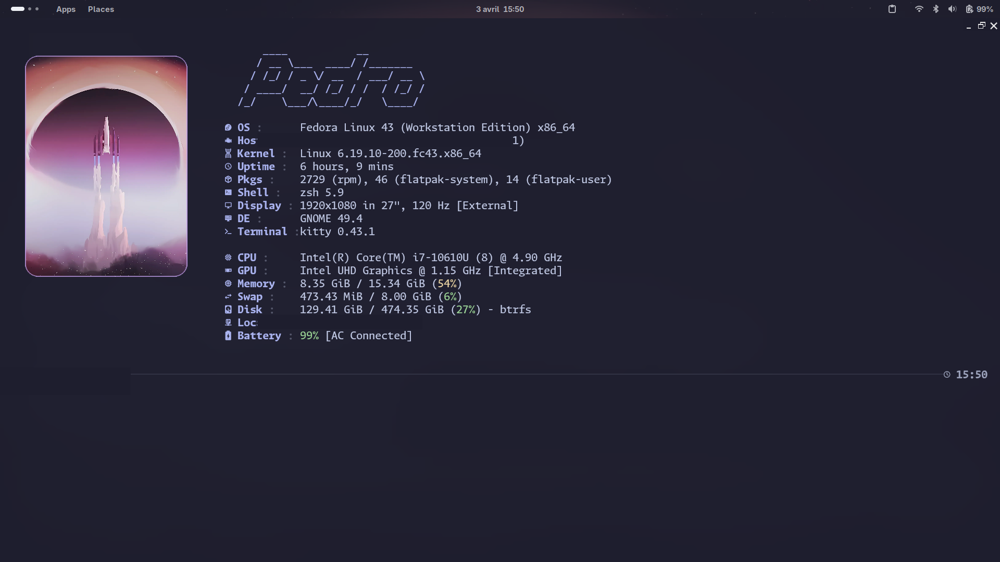

# dotfiles

My personal GNOME setup — not meant to be used as-is, but feel free to poke around or borrow whatever's useful. Primarily maintained on Fedora 43 / GNOME 49 (Wayland). Ubuntu 24.04 (X11) is tested occasionally and not guaranteed to work.



---

## Requirements

`install.sh` requires no sudo. It creates symlinks, initializes the Neovim
submodule, installs user-local CLI tools, and applies GNOME customization when a
GNOME session is detected. The following tools need to be available first.

**Fedora:**
```bash
sudo dnf install kitty zsh git curl tar python3
```

**Ubuntu:** Kitty and zsh must be available. The standard 42 environment also
needs `git`, `curl`, `tar`, `python3`, `find`, `install`, and `sha256sum`.

Kitty and Zsh are system prerequisites; `install.sh` only links their configuration.

The installer fetches verified current releases of bat, eza, Fastfetch,
Starship, zoxide, LazyGit, LazyCommit, and portable GDB. It also initializes Oh
My Zsh, zsh-autosuggestions, zsh-syntax-highlighting, and Neovim nightly. In a
GNOME session, it links the vendored Catppuccin GTK theme, installs the verified
Bibata cursor archive, installs the configured GNOME extensions for the detected
GNOME Shell major version, enables extensions where possible, and loads GNOME
settings. Missing GNOME commands outside GNOME produce a short warning and leave
the rest of the install unaffected.

---

## Install

```bash
git clone --recurse-submodules git@github.com:ruipedro-pinheiro/dotfiles.git \
  "$HOME/.local/share/dotfiles"
"$HOME/.local/share/dotfiles/install.sh"
```

Creates symlinks pointing into `~/.local/share/dotfiles`. Only the hidden shell
files `.zshrc` and `.bashrc` land directly in `~`; everything else stays under
`~/.config/` or `~/.local/share/`. A clone made without `--recurse-submodules`
is supported: `install.sh` initializes the submodules automatically. The font
cache is updated automatically.

Neovim comes from the
[`ruipedro-pinheiro/nvim`](https://github.com/ruipedro-pinheiro/nvim)
submodule. Its installer removes previous Neovim data and installs the latest
nightly plus its isolated toolchain. Stale user-local copies of LazyGit,
LazyCommit, zoxide, and GDB are removed, then replaced with the latest verified
GitHub releases in `~/.local/bin`. System installations are left untouched.

Before replacing anything, existing files are moved to
`~/.local/state/dotfiles-install-backups/<YYYYMMDD-HHMMSS>/`. Only the newest
backup is retained to fit restricted home quotas. The installer also requires
at least 2 GiB of free space before downloading or changing the setup.

GNOME settings are applied automatically by `install.sh` after themes,
extensions, and the cursor are staged. The bundled wallpaper is applied by
default. To keep the current wallpaper during installation:

```bash
APPLY_WALLPAPER=0 "$HOME/.local/share/dotfiles/install.sh"
```

For a complete reinstall on a 42 workstation, run these commands in order:

```bash
git -C "$HOME/.local/share/dotfiles" pull --ff-only
"$HOME/.local/share/dotfiles/install.sh"
exec zsh
```

Desktop-only recovery skips shell plugins, CLI tools, and the Neovim rebuild:

```bash
"$HOME/.local/share/dotfiles/install.sh" --repair-desktop
```

Each run truncates and rewrites `~/.local/state/dotfiles-install.log` with clear
phase messages and command failures.

`~/.config/gnome/apply-gnome.sh` can also be run later. It loads dconf dumps for
interface settings (GTK theme, cursor, icon theme, font), window manager
preferences, shell config, and extension settings for Dash to Dock, Blur my
Shell, and User Themes. The dconf enabled-extension list remains authoritative
when a GNOME Shell restart is required before `gnome-extensions enable` can take
effect. `apply-gnome.sh` preflights the wallpaper, GTK theme, cursor theme, icon
theme, required extensions, `dconf`, and `gsettings` before changing settings.
It stores one bounded dconf safety snapshot in XDG state and restores it if a
partial dconf/gsettings failure occurs. With `APPLY_WALLPAPER=0`, background
dconf and wallpaper `gsettings` are skipped.

---

## What's included

| Path | Notes |
|------|-------|
| `.zshrc` | Starship + zoxide init, eza/bat/lazygit aliases, runs fastfetch on first interactive shell start |
| `.bashrc` | Bash fallback configuration; Zsh is already the default shell at 42 |
| `.config/starship.toml` | 2-line prompt — fill bar pushes time to the right edge, `╰─` connector on line 2 |
| `.config/kitty/` | Catppuccin Mocha, Monaspace Argon 16pt |
| `.config/fastfetch/` | kitty-direct image protocol, Catppuccin colors — active image is `wallhaven-pol5qp-fastfetch-portrait-soft.png`, other variants included |
| `.config/nvim/` | Git submodule for the standalone Neovim nightly configuration and installer |
| `.config/lazygit/` | LazyGit commands backed by LazyCommit |
| `.config/zed/` | Zed editor theme, Vim mode, and privacy settings |
| `.config/btop/` | btop layout, theme, and monitoring preferences |
| `.config/gnome/` | dconf dumps + `apply-gnome.sh` |
| `.config/background` | Wallpaper file — `install.sh` links it into `~/.config/background`; GNOME points at it unless `APPLY_WALLPAPER=0` is set |
| `.local/share/icons/Hatter-FluentFiles/` | Merged icon theme — Hatter base, Fluent file/folder icons |
| `.themes/Catppuccin-Mauve-Dark/` | Vendored GTK theme linked into `~/.local/share/themes/` during GNOME setup |
| `.local/share/fonts/Monaspace/` | MonaspiceAr Nerd Font Mono — Regular, Italic, Bold, BoldItalic |

The fastfetch config includes `localip` and `publicip` modules. Remove them if you don't want those showing up in screenshots.

---

## Theme

| Property | Value |
|----------|-------|
| GTK | [Catppuccin-Mauve-Dark](https://github.com/catppuccin/gtk) |
| Terminal + Editor | Catppuccin Mocha (Kitty + Neovim) |
| Icons | Hatter-FluentFiles |
| Cursor | [Bibata-Modern-Ice](https://github.com/ful1e5/Bibata_Cursor) |
| Font | [Monaspace Argon Nerd Font](https://monaspace.githubnext.com/) |
| Wallpaper | [ArtStation — Moe Wanders](https://www.artstation.com/artwork/OGaRR6) |

---

## GNOME extensions

Listed as of the included dconf dump. `install.sh` resolves each extension
against the detected GNOME Shell major version through
[extensions.gnome.org](https://extensions.gnome.org), validates the returned
UUID and download path, installs the zip with `gnome-extensions install --force`,
and enables the extension where the current session allows it.

- [Blur my Shell](https://extensions.gnome.org/extension/3193/blur-my-shell/) — disable app blur if it conflicts with workspace animations on GNOME 49
- [Dash to Dock](https://extensions.gnome.org/extension/307/dash-to-dock/)
- [User Themes](https://extensions.gnome.org/extension/19/user-themes/)
- [Just Perfection](https://extensions.gnome.org/extension/3843/just-perfection/)
- [Caffeine](https://extensions.gnome.org/extension/517/caffeine/)
- [Clipboard Indicator](https://extensions.gnome.org/extension/779/clipboard-indicator/)
- [AppIndicator Support](https://extensions.gnome.org/extension/615/appindicator-support/)
- [Places Status Indicator](https://extensions.gnome.org/extension/8/places-status-indicator/) — superseded by built-in GNOME features, may not function on GNOME 49+
- [Applications Menu](https://extensions.gnome.org/extension/6/applications-menu/) — superseded by built-in GNOME features, may not function on GNOME 49+

---

## Icon theme

`Hatter-FluentFiles` is a merged theme rather than a stacked overlay (where one theme falls back to another). The Hatter and Fluent icon files were combined into a single theme directory: [Hatter](https://github.com/zigorki/hatter-icon-theme) provides the app icons, while file and folder icons are taken from [Fluent](https://github.com/vinceliuice/Fluent-icon-theme) to give Nautilus a more consistent look.
